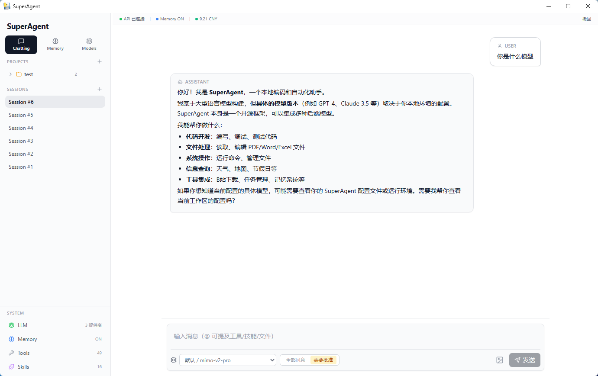
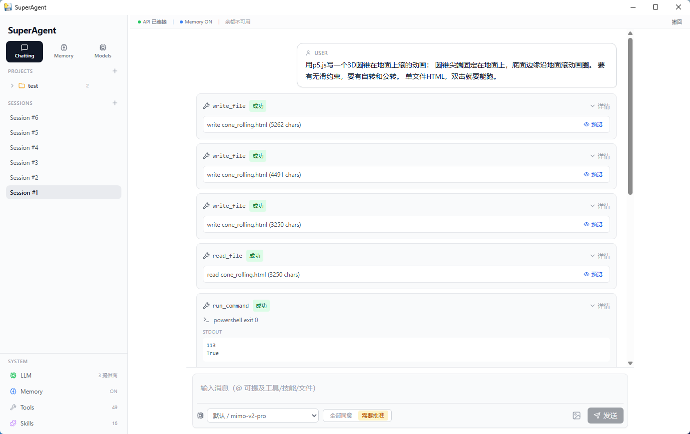
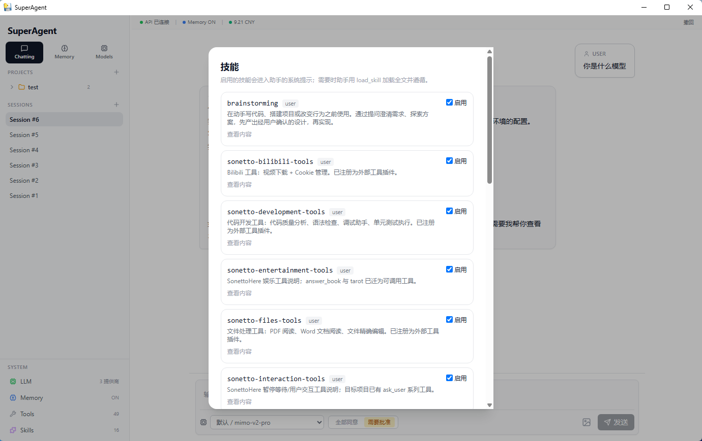
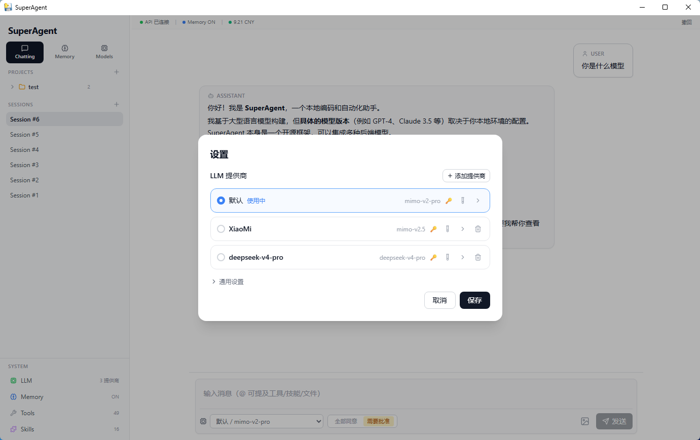

<div align="center">

# SuperAgent

**一款运行于 Windows 的桌面 AI 编码/开发助手**

内置技能系统与工程方法论，拥有自己的运行引擎（FastAPI + OpenAI-compatible Agent Loop）、前端界面（React + Tailwind CSS）与原生桌面外壳（pywebview）。

[](LICENSE)
[](https://www.python.org/)
[](https://nodejs.org/)
[](https://github.com/BoredLks/SuperAgent)
[](https://github.com/BoredLks/SuperAgent)


</div>

---

## ✨ 功能特性

| 特性 | 说明 |
|---|---|
| 🖥️ **原生桌面窗口** | pywebview 原生窗口，不弹出浏览器标签页 |
| 🤖 **多 LLM Provider** | 支持任意 OpenAI 兼容 API，可配置备用 Provider 自动 Fallback |
| 📂 **项目沙箱** | 选中项目后，AI 的文件读写和命令执行限制在该项目目录内 |
| 🛠️ **工具系统** | 内置文件读写、命令执行、文档处理等工具，支持外部插件扩展 |
| 🧠 **技能系统** | 技能按需加载（渐进式披露），内置 16 个工程方法论技能 |
| 🔄 **子代理派发** | 独立上下文的子代理执行任务，支持两阶段审查（规范符合 + 代码质量） |
| 💾 **会话管理** | 多会话、SQLite 持久化、撤回最近一轮对话 |
| 🔑 **长期记忆** | 回合结束后异步整理记忆，跨会话保持上下文 |
| 📝 **工具文档懒加载** | 复杂工具可先按需读取说明，节省上下文 Token |
| 🔒 **安全机制** | 密钥存储在本地 Keyring，不在日志中暴露 |
| 🎨 **Markdown 渲染** | GFM + Prism 代码高亮 + 代码块复制 |
| 🌐 **HTML 沙箱** | HTML 代码在 sandboxed iframe 中安全预览 |

## 📸 截图预览

<div align="center">

<!-- 请将截图放入 docs/screenshots/ 目录 -->









</div>

> 📌 请截图并保存到 `docs/screenshots/` 目录，文件名对应上方引用：
> - `hero.png` — 主页标题区域的大图（建议 1280×720）
> - `main-ui.png` — 完整聊天界面截图（含侧边栏 + 对话 + 输入区）
> - `tool-calling.png` — 工具调用过程的可视化展示
> - `skills-panel.png` — 技能面板展示
> - `settings.png` — 设置中心（Provider 配置页）

---

## 🚀 快速开始

### 前置要求

| 依赖 | 版本 | 说明 |
|---|---|---|
| Windows | 10 / 11 | 操作系统 |
| Python | 3.10+ | 后端运行环境 |
| Node.js | 18+ | 前端构建 |
| Edge WebView2 Runtime | — | pywebview 桌面窗口依赖 |

### 1. 获取代码

```powershell
git clone https://github.com/BoredLks/SuperAgent.git
cd SuperAgent
```

### 2. 安装后端依赖

```powershell
py -3.10 -m venv .venv
.venv\Scripts\python.exe -m pip install -r requirements.txt
```

复制环境变量模板并填入你的 API Key：

```powershell
Copy-Item backend\.env.example backend\.env
# 编辑 backend\.env，填入 OPENAI_API_KEY
```

### 3. 安装前端依赖

```powershell
npm install --prefix frontend
```

### 4. 启动

**方式 A：从源码运行（开发态）**

```powershell
# 终端 1：启动后端
.venv\Scripts\python.exe -m uvicorn app.main:app --app-dir backend --reload

# 终端 2：启动前端
npm --prefix frontend run dev
```

前端开发服务默认在 `http://127.0.0.1:5173`。

**方式 B：构建桌面应用**

```powershell
powershell -ExecutionPolicy Bypass -File .\build\build.ps1
.\dist\SuperAgent\SuperAgent.exe
```

应用会自动选择可用本地端口启动 FastAPI 后端，并用 pywebview 原生窗口加载同源前端页面。

### 5. 首次使用

1. 启动后，在左侧「项目」区域点击「添加项目」，输入你希望 AI 工作的项目目录
2. 选中项目后，AI 的 `write_file`、`read_file`、`list_dir` 与 `run_command` 都会以该目录为工作区
3. 在底部输入框发送消息，开始与 AI 对话

---

## 🏗️ 架构概览

```
┌─────────────────────────────────────────────────────┐
│                   Desktop Shell                      │
│                  (pywebview + PyInstaller)            │
├──────────────────────┬──────────────────────────────┤
│      Frontend        │         Backend              │
│  React + TypeScript  │     FastAPI + Python          │
│  Zustand + Tailwind  │                               │
│  Vite + Vitest       │  ┌─────────┐ ┌────────────┐  │
│                      │  │  Agent  │ │   Tools    │  │
│  ┌────────────────┐  │  │  Loop   │ │  Registry  │  │
│  │   Components   │  │  │ (LLM)  │ │ (Built-in) │  │
│  │  ChatView      │  │  └─────────┘ └────────────┘  │
│  │  SkillsPanel   │  │  ┌─────────┐ ┌────────────┐  │
│  │  SettingsPanel │  │  │  Skills │ │  Storage   │  │
│  │  ToolsPanel    │  │  │ Loader  │ │  (SQLite)  │  │
│  └────────────────┘  │  └─────────┘ └────────────┘  │
└──────────────────────┴──────────────────────────────┘
```

```text
backend/          FastAPI 后端
  app/agent/        Agent Loop、上下文管理、子代理、记忆
  app/api/          REST API + WebSocket 端点
  app/core/         配置、密钥管理、资源路径
  app/skills/       技能加载器
  app/skills_builtin/  内置技能（16 个）
  app/tools/        工具系统（注册表、插件、交互暂停）
  app/storage/      SQLite DAO
  app/desktop/      pywebview 桌面启动器
  tests/            后端测试套件（71+ 测试）
frontend/         React + TypeScript + Vite + Zustand + Tailwind
build/            PyInstaller spec 与构建脚本
tools/            外部工具插件（可选，构建时复制到 dist）
personas/         自定义人格片段（可选）
```

---

## 🛠️ 工具系统

内置工具涵盖文件操作、命令执行、文档处理等领域：

| 类别 | 工具 | 说明 |
|---|---|---|
| 文件 | `write_file` / `read_file` / `list_dir` | 在项目沙箱内读写文件和目录 |
| 命令 | `run_command` | 在项目目录内执行命令（PowerShell / CMD） |
| 文档 | `read_pdf` / `read_docx` / `read_xlsx` | 读取 PDF、Word、Excel 文档 |
| 交互 | `ask_user_qa` / `ask_user_single_choice` / `ask_user_multi_choice` | Agent 中途暂停等待用户输入 |
| 代码 | `run_python` | 执行前展示代码并等待确认，确认后运行 Python 子进程 |
| 知识 | `load_tool_doc` | 按需加载工具文档，节省上下文 Token |
| 代理 | `dispatch_subagent` | 创建独立上下文的子代理执行子任务 |

### 扩展工具插件

将 Python 文件放入 `tools/` 目录（源码态）或 `dist/SuperAgent/tools/`（打包态）：

```python
# my_plugin.py
from app.tools.base import Tool, ToolSpec, ToolResult, ToolContext

class MyTool(Tool):
    spec = ToolSpec(
        name="my_tool",
        description="A custom tool.",
        parameters={...},
    )

    async def run(self, args, ctx: ToolContext) -> ToolResult:
        return ToolResult(True, "result")

def register(registry):
    registry.register(MyTool())
```

---

## 🧩 技能系统

技能是存放在 `skills_builtin/` 目录下的独立技能包，每个子文件夹包含一个 `SKILL.md`：

```markdown
---
name: brainstorming
description: Use when starting any creative or design work before implementation.
---
# Brainstorming Skill
...
```

### 渐进式披露

- **会话开始时**：只注入技能的 `name + description` 元数据索引
- **命中时**：按需加载技能全文到上下文
- **目的**：节省 Context Token

### 内置技能

| 技能 | 说明 |
|---|---|
| `brainstorming` | 创意/设计阶段的头脑风暴 |
| `writing-plans` | 将设计拆分为可执行的小任务 |
| `test-driven-development` | TDD 工作流（RED → GREEN → REFACTOR） |
| `subagent-driven-development` | 子代理派发 + 两阶段审查 |
| `sonetto-bilibili-tools` | B 站视频下载工具文档 |
| `sonetto-development-tools` | 开发工具文档 |
| `sonetto-files-tools` | 文件操作工具文档 |
| `sonetto-memory-tools` | 记忆管理工具文档 |
| ... | 更多技能见 `backend/app/skills_builtin/` |

---

## ⚙️ 配置说明

### LLM Provider

首次使用需在设置中心配置 LLM Provider：

1. 点击顶栏「设置」按钮
2. 在「模型」标签页添加 Provider（Base URL + API Key + Model）
3. 支持任意 OpenAI 兼容 API（DeepSeek、OpenRouter、智谱、本地 Ollama 等）

`.env.example` 模板：

```env
OPENAI_BASE_URL=https://api.deepseek.com/v1
OPENAI_API_KEY=your-api-key-here
OPENAI_MODEL=deepseek-chat
LLM_TEMPERATURE=0.7
```

### 多 Provider Fallback

设置面板可添加备用 Provider，主 Provider 异常时自动切换。

---

## 🧪 测试

```powershell
# 后端测试
.venv\Scripts\python.exe -m pytest backend\tests -q

# 前端类型检查 + 构建
npm --prefix frontend run build

# 前端单测
npm --prefix frontend run test
```

---

## 📦 构建桌面应用

```powershell
powershell -ExecutionPolicy Bypass -File .\build\build.ps1
```

构建脚本自动完成：

1. 前端构建（Vite）
2. 后端依赖确认 + PyInstaller 安装
3. onedir 打包（`build/superagent.spec`）
4. 内置技能 + 前端产物复制到 `dist/SuperAgent/`
5. 创建可扩展的 `skills/` 和 `tools/` 目录

输出目录：

```text
dist/SuperAgent/
  SuperAgent.exe     # 双击启动
  _internal/         # PyInstaller 依赖
  skills/            # 技能目录（用户可扩展）
  tools/             # 工具插件目录（用户可扩展）
```

---

## 🔒 安全

- **密钥管理**：API Key 不硬编码、不写日志，通过设置中心保存到本地 Keyring
- **项目沙箱**：选中项目后，文件操作和命令执行限制在项目目录内，越界路径被拒绝
- **本地存储**：会话、设置、技能状态等数据本地优先存储，除调用 LLM API 外不上传
- **Python 执行确认**：`run_python` 执行前展示代码并等待用户确认

---

## 🤝 贡献

欢迎通过 Issues 提交 Bug 报告或功能建议，也欢迎提交 Pull Request。

### 开发环境

```powershell
# 后端（热重载）
.venv\Scripts\python.exe -m uvicorn app.main:app --app-dir backend --reload

# 前端（热重载）
npm --prefix frontend run dev

# 桌面窗口（连接 Vite 开发服务）
$env:SUPERAGENT_UI_URL = "http://127.0.0.1:5173"
.venv\Scripts\python.exe -m app.desktop.launch
```

---

## 📜 开源协议

本项目基于 [MIT License](LICENSE) 开源。

---

## 🙏 致谢

- [Superpowers](https://github.com/jesseVincent/superpowers) — 技能系统与工程方法论的灵感来源
- [SonettoHere](https://github.com/Miso2233/SonettoHere) — 工具文档懒加载、交互暂停、结构化展示等工程实践
- [FastAPI](https://fastapi.tiangolo.com/) / [React](https://react.dev/) / [Zustand](https://github.com/pmndrs/zustand) / [pywebview](https://pywebview.flowrl.com/) / [PyInstaller](https://pyinstaller.org/) — 核心技术栈

---

<div align="center">

**如果 SuperAgent 对你有帮助，欢迎给一个 ⭐ Star！**

</div>